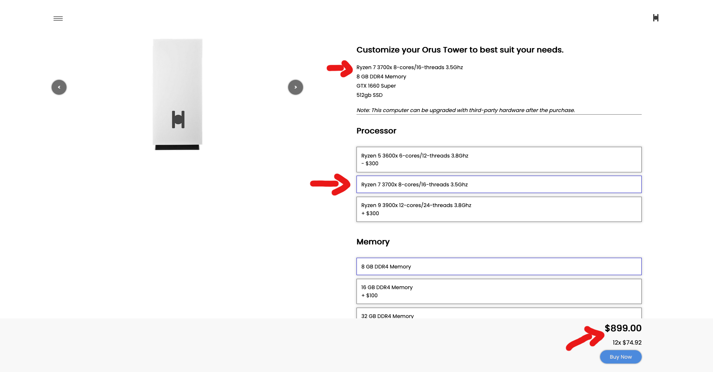

# Orus e-Commerce Project

- Link to Website: 

- This project was created for my portfolio and also to enhance my development skills.

## Tools used in this project:
- Development Tools: 
**HTML, CSS and Vanilla Javascript.**

- Design/UI tools: 
**Adobe XD, Affinity Design**

- This website was created using **Mozilla Firefox**, however, it was also tested on the following browsers: **Google Chrome, Safari, Edge and Brave.**

## What will the user be able to do?

- The index page will display the products available, along with a short description of the company.

- When the user clicks on the 'buy now' button, he/she will be taken to that product page, and a list of updates related to the product will be displayed. Selecting an upgrade will increase the final price of the product (expect for color options).

